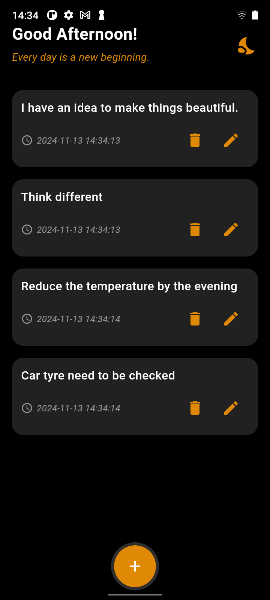

---

# flutter_notes_supabase

A simple Flutter application that allows users to take notes, backed by Supabase as the backend. Users can add, update, and delete notes, with a smooth, animated UI and integration with Supabase for data management.

---

## Features

- **Real-time Note Updates**: Syncs notes with Supabase in real-time.
- **Note Management**: Add, edit, or delete notes seamlessly.
- **Responsive UI**: Elegant design that adapts to different screen sizes.
- **Animations**: Smooth animation when adding or removing notes.

---

## Screenshots

Here are some screenshots showcasing the app:

  
*Add a note screen*

  
*Main screen with notes list*

---

## Getting Started

To get a local copy up and running, follow these simple steps.

### Prerequisites

- Flutter SDK (version 3.5.4 or higher)
- A Supabase account (for configuring API keys and connecting your app)

### Installing

1. Clone the repository:

   ```bash
   git clone https://github.com/navendunandu/flutter_notes_supabase.git
   ```

2. Navigate to the project folder:

   ```bash
   cd flutter_notes_supabase
   ```

3. Install dependencies:

   ```bash
   flutter pub get
   ```

4. Set up Supabase in your project:
   - Create a `.env` file in the root of your project and add your Supabase URL and Anon Key.

   ```
   SUPABASE_URL=your-supabase-url
   SUPABASE_ANON_KEY=your-supabase-anon-key
   ```

5. Run the app:

   ```bash
   flutter run
   ```

---

## CRUD Operations

This app implements full **CRUD** (Create, Read, Update, Delete) functionality using Supabase as the backend.

1. **Create (Insert Note)**:
   - Users can add a new note by typing into the text field and submitting. The note is saved to the Supabase database using the `insertNote` method.

   ```dart
   Future<void> insertNote(String note) async {
     await Supabase.instance.client
         .from('notes')
         .insert({'body': note});
   }
   ```

2. **Read (Fetch Notes)**:
   - The app displays a list of notes fetched in real-time using a stream from Supabase.

   ```dart
   final _notesStream = Supabase.instance.client.from('notes').stream();
   ```

3. **Update (Edit Note)**:
   - Users can edit an existing note by selecting the edit icon. The `updateNote` method is used to update the note content in the database.

   ```dart
   Future<void> updateNote(int id, String note) async {
     await Supabase.instance.client
         .from('notes')
         .update({'body': note})
         .eq('id', id);
   }
   ```

4. **Delete (Remove Note)**:
   - Users can delete a note by selecting the delete icon. The `deleteNote` method removes the note from the database.

   ```dart
   Future<void> deleteNote(int id) async {
     await Supabase.instance.client
         .from('notes')
         .delete()
         .eq('id', id);
   }
   ```

These operations are connected to a real-time stream, so any changes are immediately reflected in the UI.

---

## Download Build

You can download the latest build of the app from the link below:

- [Download APK](Note%20App.apk)

---

## Tech Stack

- **Flutter**: Used for building cross-platform apps.
- **Supabase**: Provides the backend for storing and managing notes.
- **Intl**: For formatting dates and times.
  
---

## Contributing

Feel free to fork this project, create a branch, and submit a pull request for any improvements or new features.

---

## License

This project is licensed under the MIT License - see the [LICENSE](LICENSE) file for details.

---