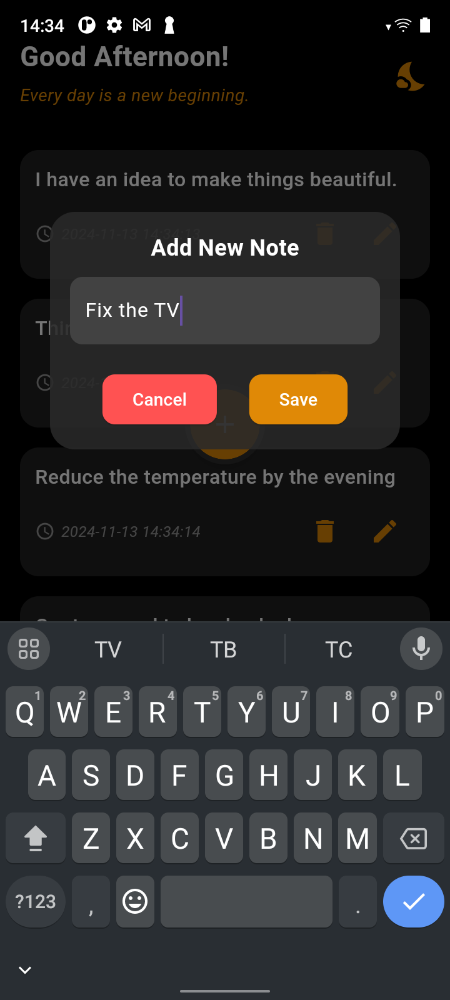

Here's a sample **README** file for your project `flutter_notes_supabase`, designed to include project description, screenshot section, and a link for users to download the build. You can modify the download URL as needed after hosting your APK or build file.

---

# flutter_notes_supabase

A simple Flutter application that allows users to take notes, backed by Supabase as the backend. Users can add, update, and delete notes, with a smooth, animated UI and integration with Supabase for data management.

---

## Features

- **Real-time Note Updates**: Syncs notes with Supabase in real-time.
- **Note Management**: Add, edit, or delete notes seamlessly.
- **Responsive UI**: Elegant design that adapts to different screen sizes.
- **Animations**: Smooth animation when adding or removing notes.

---

## Screenshots

Here are some screenshots showcasing the app:


*Add a note screen*


*Main screen with notes list*

---

## Getting Started

To get a local copy up and running, follow these simple steps.

### Prerequisites

- Flutter SDK (version 3.5.4 or higher)
- A Supabase account (for configuring API keys and connecting your app)

### Installing

1. Clone the repository:

   ```bash
   git clone https://github.com/navendunandu/noteit_flutter_supabase.git
   ```

2. Navigate to the project folder:

   ```bash
   cd flutter_notes_supabase
   ```

3. Install dependencies:

   ```bash
   flutter pub get
   ```

4. Set up Supabase in your project:
   - Create a `.env` file in the root of your project and add your Supabase URL and Anon Key.

   ```
   SUPABASE_URL=your-supabase-url
   SUPABASE_ANON_KEY=your-supabase-anon-key
   ```

5. Run the app:

   ```bash
   flutter run
   ```

---

## Download Build

You can download the latest build of the app from the link below:

- [Download APK](Note%20App.apk)

---

## Tech Stack

- **Flutter**: Used for building cross-platform apps.
- **Supabase**: Provides the backend for storing and managing notes.
- **Intl**: For formatting dates and times.
  
---

## Contributing

Feel free to fork this project, create a branch, and submit a pull request for any improvements or new features.

---

## License

This project is licensed under the MIT License - see the [LICENSE](LICENSE) file for details.

---
